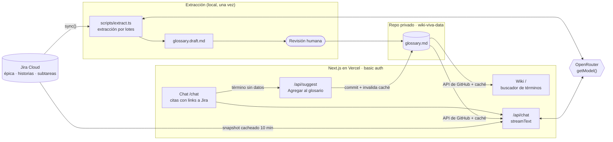

# Wiki viva de terminología

Asistente que responde dudas de terminología y casos especiales del negocio, para no tener que preguntarle a un compañero. MVP de un día.

Un LLM extrae un glosario de una épica de Jira, una persona lo revisa y el glosario alimenta dos salidas:

- **Wiki** (`/`): lista de términos con buscador, sinónimos, casos especiales y fuentes linkeadas a Jira.
- **Chat** (`/chat`): responde solo con el glosario y las tarjetas de la épica, citando las claves de Jira (ej: `ABC-123`). Si no encuentra un término, lo dice y ofrece **"Agregar al glosario"**.

## Arquitectura



También como imagen: [`docs/arquitectura.png`](docs/arquitectura.png). Se regenera desde el bloque de arriba con `npx @mermaid-js/mermaid-cli -i arquitectura.mmd -o docs/arquitectura.png -w 1600 -s 2 -b white`.

- **El glosario real no está en este repo.** Vive en un repo privado (`GLOSSARY_REPO`) porque contiene terminología y reglas de negocio del cliente. La app lo lee con la API de GitHub y lo cachea; al agregar un término se invalida la caché. Sin `GLOSSARY_REPO`, la app usa [`glossary.example.md`](glossary.example.md), con datos ficticios.
- **Conectores**: toda fuente implementa `SourceConnector` (`src/connectors/types.ts`). Hoy hay uno, Jira (`src/connectors/jira.ts`). Agregar una fuente = un conector nuevo + una entrada en `src/connectors/registry.ts`.
- **LLM**: vía OpenRouter, siempre a través de `getModel()` (`src/lib/model.ts`). `LLM_MODEL` acepta una lista separada por comas de modelos de respaldo.
- Sin base de datos. El snapshot de Jira se cachea en memoria 10 minutos.

Stack: Next.js 16 (App Router, Cache Components) · TypeScript · Tailwind · Vercel AI SDK · OpenRouter · Jira Cloud REST API.

## Correr en local

```bash
npm install
cp .env.example .env.local   # completar las variables
npm run dev                  # http://localhost:3000
```

Variables (ver `.env.example`):

| Variable | Para qué |
|---|---|
| `BASIC_AUTH_USER`, `BASIC_AUTH_PASSWORD` | Acceso a la app (basic auth). `BASIC_AUTH_USERS` acepta usuarios extra: `user:pass,user2:pass2`. |
| `LLM_PROVIDER`, `LLM_MODEL`, `OPENROUTER_API_KEY` | Modelo del chat y de la extracción. |
| `JIRA_BASE_URL`, `JIRA_EMAIL`, `JIRA_API_TOKEN` | Acceso a Jira Cloud (API token). |
| `JIRA_EPIC_KEY`, `JIRA_EPIC_JQL`, `JIRA_PROJECT_KEY` | Épica a leer (ej: `ABC-100`, `parent = ABC-100`, `ABC`). |
| `GLOSSARY_REPO`, `GITHUB_TOKEN` | Repo privado con `glossary.md` y un fine-grained token con *Contents: read/write* solo sobre ese repo. Opcionales: sin ellos se usa el glosario de ejemplo y "Agregar al glosario" queda deshabilitado. |

## Generar el glosario

```bash
npx tsx scripts/jira-check.ts      # prueba el conector: tarjetas por tipo, comentarios, tamaño en tokens
npx tsx scripts/extract.ts         # extracción por lotes → glossary.draft.md (no se commitea)
```

Revisar `glossary.draft.md` a mano y subirlo como `glossary.md` al repo privado de datos. Formato de cada término:

```markdown
## Orden de compra
**Siglas / sinónimos:** OC, Pedido
**Definición:** Documento que registra lo que un cliente compra.
**Casos especiales:** Una OC confirmada no se puede editar.
**Fuentes:** ABC-101, ABC-102
```

## Deploy

Vercel, con deploy automático en cada push a `main`. Cargar las mismas variables en el proyecto de Vercel. Antes de pushear: `npm run build`.

Más detalle del diseño y las decisiones en [`CLAUDE.md`](CLAUDE.md) y [`PLAN.md`](PLAN.md).
